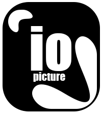

  

<h3 align="center">IO_IMAGE LIBRARY</h3>

 Full C++ Computer Vision Library 
      

## 🧐 Problem Statement 

    Cause arrived to a century where, everything is dominated by esthetic form, design and graphical art, the problematic to automate some tasks to gain productivity and efficiency bornt. Computer Vision(CV) means to the grouping of all methods of allowing this automating. But, despite theses "methods" which are however very accessibles remained unknow to the majority.
    
    Then the necessity of creation of a library including all theses was underlined.
    What this library promote is non only facilitate access but also the deep comprehension about Computer Vision, bringing and regrouping methods, guides, and reflexions about the aroused problematic.       

## ⛓️ Limitations 

    One of the principal problem in computer vision is conserving and retrieving informations. In fact, in most cases catching and conserving informations are accompagned to errors, for example taking a photo with any device will never be exact as eyes see.

    What we'll attemp is to try to retrieve with the minimal error as possible the initial informations, with well-approximative algorithms and logicals issues.

## 🏁 Getting Started 

    No special installation needed, just copy and past "src" and "include" folders in your project directory, a makefile and windows bash script are provided by default.
    Note : for display purpose, a save to PNG moule is installed by default, just delete them if you want.

##  ✔✔ Features <a name = "features">

    -  colors spaces conversion(rgb, hsl, hsv, ...)
    -  image segmentation(threshold method and otsu nobuyuki method)
    -  dominants color computing(default method and Lloyd algorithm)
    -  colorisation by lut (look up table)
    -  color overscrenning method(default method and Lloyd Algorithm)
    -  channels extraction(rgb to redn green, blue, ...) 
    -  color modes conversion(rgb to gray, rgba to rgb, rgb to binary)
    -  mixed median cut qunatification(in development)
    -  luminance to chromatic retrieving by neighbour search(in development)
    -  colorisation par neighbour propagation(in development)
    -  graphical interface for output using opengl(in development)
    -  PNG module for image output(in development)
    -  histogram egalisation by parts linear regression (in development)
    -  cie Lab and CIE Luv conversion(in development)
    -  histogram ploting graph(using Ploter-flag- Module)
    -  histogram computing
    -  some supports of multithreading
    -  ...

## ⛏️ Built With C++ [GNU GCC] 

    Makefile and windows bash compiling and linking files provides.

## ✍️ Authors 

    [@igorgreenIGM](https://github.com/igorgreenIGM) - Idea & Initial work

## 💨 Examples 

    Various implementations results can be found in the folder "Examples"